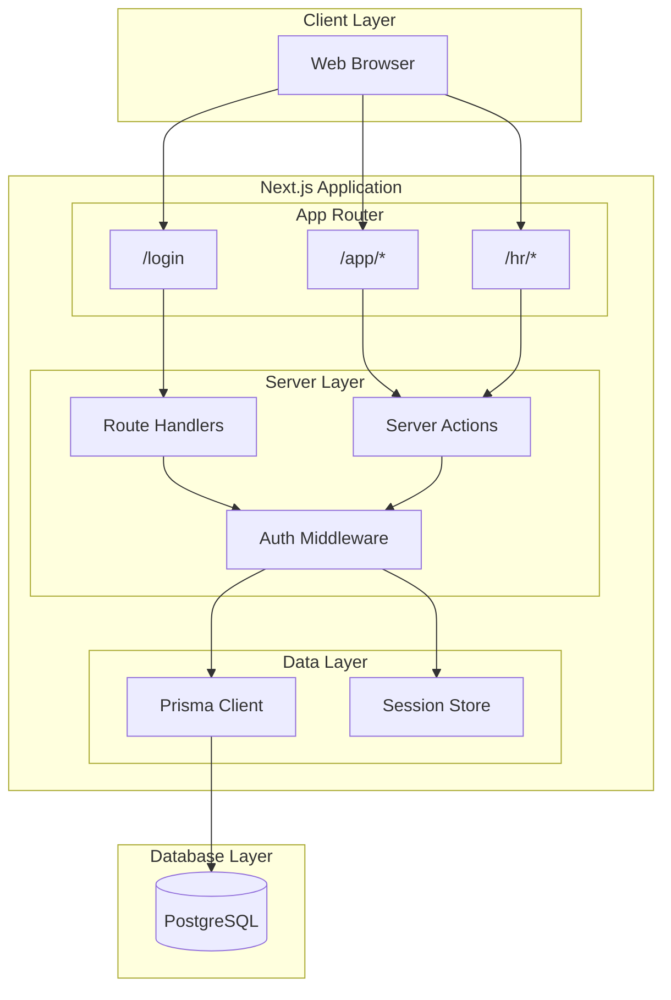
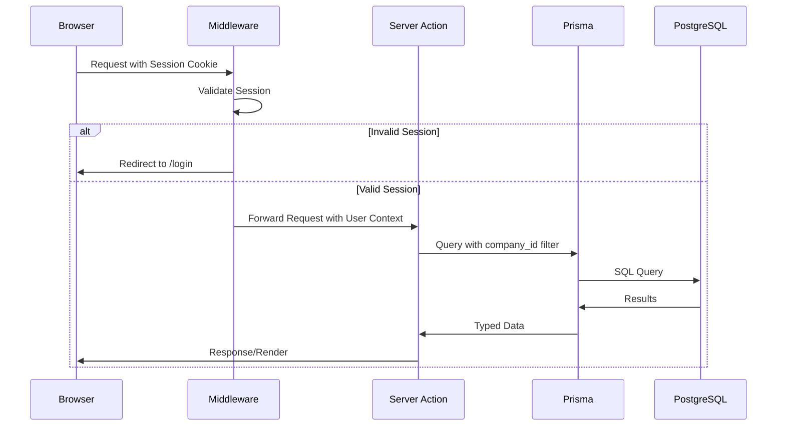
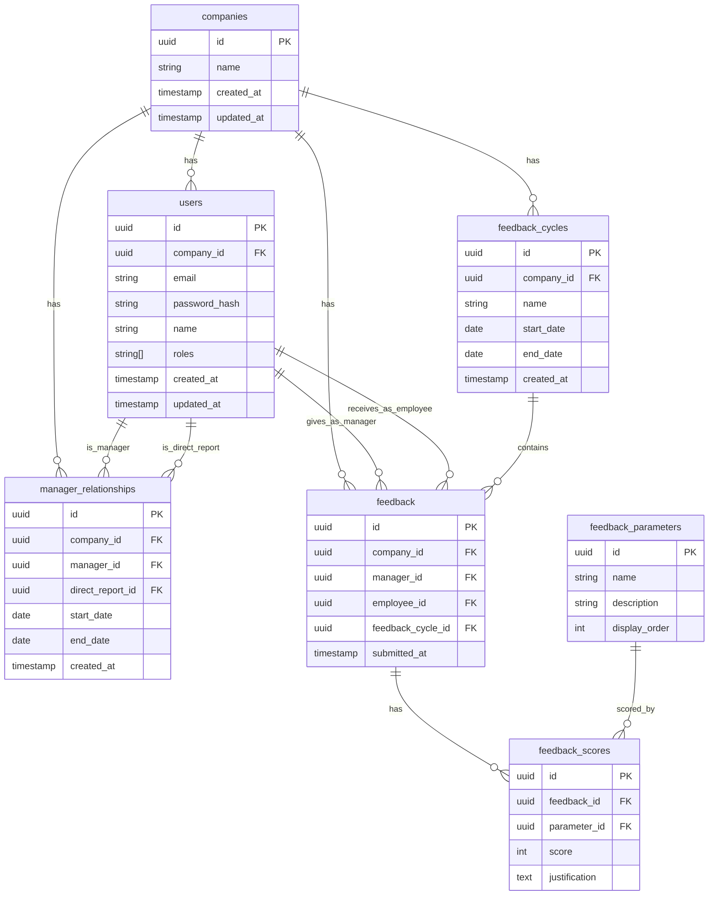

# Technical Design Document

## Overview

The Performance Evaluation Tool is a multi-tenant web application enabling managers to provide structured monthly feedback to their direct reports. The system supports two organizational models: hierarchical (with middle management) and flat (single manager for all employees). Built with Next.js 14+ App Router and TypeScript, the application uses PostgreSQL for data persistence with Prisma ORM, and a simple seeded authentication system.

The architecture follows a tenant-isolation-first approach where Company serves as the primary data boundary. All queries are scoped by company_id to ensure complete data isolation between tenants.

### Key Design Decisions

1. **Normalized Feedback Scores**: Instead of storing scores as columns (ownership_score, communication_score, etc.), we use a normalized feedback_scores table with one row per parameter per feedback. This allows flexible parameter configuration in the future.

2. **Separate Manager Relationships**: Manager relationships are stored in a dedicated table rather than a manager_id column on users. This supports time-bounded relationships (start/end dates) and historical tracking.

3. **Company-Scoped Everything**: All tables include company_id as a foreign key, and all queries include company filtering to enforce multi-tenant isolation.

4. **Dual-App Architecture**: Employee App (/app/*) and HR App (/hr/*) are separate route groups with distinct navigation and access control.

---

## Architecture

### System Architecture Diagram



### Request Flow Diagram



### Technology Stack

| Layer | Technology | Purpose |
|-------|------------|---------|
| Frontend | Next.js 14+ (App Router) | React framework with server components |
| Styling | Tailwind CSS + shadcn/ui | Utility-first CSS with accessible components |
| Language | TypeScript | Type safety across the stack |
| Backend | Next.js Route Handlers / Server Actions | API endpoints and form handling |
| ORM | Prisma | Type-safe database access |
| Database | PostgreSQL | Relational data storage |
| Auth | Custom session-based | Simple seeded login system |
| Deployment | Vercel + Neon/Supabase | Serverless hosting with managed Postgres |

---

## Components and Interfaces

### Core Domain Components

#### Authentication Module

```typescript
// lib/auth/types.ts
interface User {
  id: string;
  email: string;
  name: string;
  companyId: string;
  roles: UserRole[];
}

type UserRole = 'employee' | 'manager' | 'hr';

interface Session {
  userId: string;
  companyId: string;
  roles: UserRole[];
  expiresAt: Date;
}

interface AuthResult {
  success: boolean;
  user?: User;
  error?: string;
}
```

```typescript
// lib/auth/actions.ts
async function login(email: string, password: string): Promise<AuthResult>
async function logout(): Promise<void>
async function getSession(): Promise<Session | null>
async function requireAuth(allowedRoles?: UserRole[]): Promise<User>
```

#### Feedback Module

```typescript
// lib/feedback/types.ts
interface FeedbackParameter {
  id: string;
  name: 'ownership' | 'communication' | 'quality_of_work' | 'teamwork' | 'initiative';
  description: string;
}

interface FeedbackScore {
  parameterId: string;
  parameterName: string;
  score: number; // 1-5
  justification: string;
}

interface Feedback {
  id: string;
  managerId: string;
  managerName: string;
  employeeId: string;
  employeeName: string;
  feedbackCycleId: string;
  cycleName: string;
  scores: FeedbackScore[];
  submittedAt: Date;
}

interface FeedbackSubmission {
  employeeId: string;
  feedbackCycleId: string;
  scores: Array<{
    parameterId: string;
    score: number;
    justification: string;
  }>;
}
```

```typescript
// lib/feedback/actions.ts
async function submitFeedback(data: FeedbackSubmission): Promise<{ success: boolean; error?: string }>
async function getFeedbackForEmployee(employeeId: string): Promise<Feedback[]>
async function getPendingFeedbackForManager(managerId: string): Promise<DirectReportStatus[]>
async function getFeedbackByParameter(employeeId: string, parameterId: string): Promise<Feedback[]>
```

#### Manager Relationship Module

```typescript
// lib/relationships/types.ts
interface ManagerRelationship {
  id: string;
  managerId: string;
  managerName: string;
  directReportId: string;
  directReportName: string;
  companyId: string;
  startDate: Date;
  endDate: Date | null;
}

interface DirectReportStatus {
  employeeId: string;
  employeeName: string;
  hasFeedbackThisCycle: boolean;
}
```

```typescript
// lib/relationships/actions.ts
async function getDirectReports(managerId: string): Promise<ManagerRelationship[]>
async function getManager(employeeId: string): Promise<ManagerRelationship | null>
async function isActiveDirectReport(managerId: string, employeeId: string): Promise<boolean>
```

#### Feedback Cycle Module

```typescript
// lib/cycles/types.ts
interface FeedbackCycle {
  id: string;
  name: string;
  companyId: string;
  startDate: Date;
  endDate: Date;
}
```

```typescript
// lib/cycles/actions.ts
async function getCurrentCycle(companyId: string): Promise<FeedbackCycle | null>
async function getCyclesByCompany(companyId: string): Promise<FeedbackCycle[]>
```

#### HR Compliance Module

```typescript
// lib/hr/types.ts
interface ManagerComplianceStatus {
  managerId: string;
  managerName: string;
  totalDirectReports: number;
  completedFeedback: number;
  pendingFeedback: number;
}
```

```typescript
// lib/hr/actions.ts
async function getComplianceReport(companyId: string, cycleId: string): Promise<ManagerComplianceStatus[]>
async function getManagersWithPendingFeedback(companyId: string, cycleId: string): Promise<ManagerComplianceStatus[]>
```

### UI Components

#### Page Components

| Route | Component | Description |
|-------|-----------|-------------|
| `/login` | `LoginPage` | Authentication form |
| `/app/dashboard` | `ManagerDashboard` | Pending feedback overview |
| `/app/my-feedback` | `MyFeedbackPage` | View received feedback |
| `/app/give-feedback/[employeeId]` | `GiveFeedbackPage` | Feedback submission form |
| `/app/team` | `TeamOverviewPage` | Team status (managers only) |
| `/app/history` | `FeedbackHistoryPage` | Historical feedback with filters |
| `/hr/dashboard` | `HRDashboardPage` | HR overview |
| `/hr/missing-feedback` | `MissingFeedbackPage` | Compliance monitoring |

#### Shared UI Components

```typescript
// components/feedback/FeedbackForm.tsx
interface FeedbackFormProps {
  employeeId: string;
  employeeName: string;
  cycleId: string;
  cycleName: string;
  parameters: FeedbackParameter[];
  onSubmit: (data: FeedbackSubmission) => Promise<void>;
}

// components/feedback/FeedbackCard.tsx
interface FeedbackCardProps {
  feedback: Feedback;
  showManager?: boolean;
}

// components/feedback/ScoreDisplay.tsx
interface ScoreDisplayProps {
  score: number;
  size?: 'sm' | 'md' | 'lg';
}

// components/dashboard/DirectReportList.tsx
interface DirectReportListProps {
  directReports: DirectReportStatus[];
  cycleId: string;
}

// components/hr/ComplianceTable.tsx
interface ComplianceTableProps {
  managers: ManagerComplianceStatus[];
  showOnlyPending?: boolean;
}

// components/layout/AppNavigation.tsx
interface AppNavigationProps {
  user: User;
  currentPath: string;
}
```

### API Routes

| Method | Route | Purpose |
|--------|-------|---------|
| POST | `/api/auth/login` | Authenticate user |
| POST | `/api/auth/logout` | End session |
| GET | `/api/auth/session` | Get current session |

Most data operations use Server Actions for form submissions and server components for data fetching, minimizing the need for REST endpoints.

---

## Data Models

### Entity Relationship Diagram



### Prisma Schema

```prisma
// prisma/schema.prisma

generator client {
  provider = "prisma-client-js"
}

datasource db {
  provider = "postgresql"
  url      = env("DATABASE_URL")
}

model Company {
  id        String   @id @default(uuid())
  name      String
  createdAt DateTime @default(now()) @map("created_at")
  updatedAt DateTime @updatedAt @map("updated_at")

  users               User[]
  feedbackCycles      FeedbackCycle[]
  managerRelationships ManagerRelationship[]
  feedback            Feedback[]

  @@map("companies")
}

model User {
  id           String   @id @default(uuid())
  companyId    String   @map("company_id")
  email        String
  passwordHash String   @map("password_hash")
  name         String
  roles        String[] @default(["employee"])
  createdAt    DateTime @default(now()) @map("created_at")
  updatedAt    DateTime @updatedAt @map("updated_at")

  company              Company               @relation(fields: [companyId], references: [id], onDelete: Cascade)
  managedRelationships ManagerRelationship[] @relation("Manager")
  reportingRelationships ManagerRelationship[] @relation("DirectReport")
  givenFeedback        Feedback[]            @relation("FeedbackGiver")
  receivedFeedback     Feedback[]            @relation("FeedbackReceiver")

  @@unique([companyId, email])
  @@map("users")
}

model ManagerRelationship {
  id            String    @id @default(uuid())
  companyId     String    @map("company_id")
  managerId     String    @map("manager_id")
  directReportId String   @map("direct_report_id")
  startDate     DateTime  @map("start_date") @db.Date
  endDate       DateTime? @map("end_date") @db.Date
  createdAt     DateTime  @default(now()) @map("created_at")

  company      Company @relation(fields: [companyId], references: [id], onDelete: Cascade)
  manager      User    @relation("Manager", fields: [managerId], references: [id], onDelete: Cascade)
  directReport User    @relation("DirectReport", fields: [directReportId], references: [id], onDelete: Cascade)

  @@unique([managerId, directReportId, startDate])
  @@map("manager_relationships")
}

model FeedbackCycle {
  id        String   @id @default(uuid())
  companyId String   @map("company_id")
  name      String
  startDate DateTime @map("start_date") @db.Date
  endDate   DateTime @map("end_date") @db.Date
  createdAt DateTime @default(now()) @map("created_at")

  company  Company    @relation(fields: [companyId], references: [id], onDelete: Cascade)
  feedback Feedback[]

  @@unique([companyId, startDate])
  @@map("feedback_cycles")
}

model FeedbackParameter {
  id           String @id @default(uuid())
  name         String @unique
  description  String
  displayOrder Int    @map("display_order")

  scores FeedbackScore[]

  @@map("feedback_parameters")
}

model Feedback {
  id              String   @id @default(uuid())
  companyId       String   @map("company_id")
  managerId       String   @map("manager_id")
  employeeId      String   @map("employee_id")
  feedbackCycleId String   @map("feedback_cycle_id")
  submittedAt     DateTime @default(now()) @map("submitted_at")

  company       Company       @relation(fields: [companyId], references: [id], onDelete: Cascade)
  manager       User          @relation("FeedbackGiver", fields: [managerId], references: [id], onDelete: Cascade)
  employee      User          @relation("FeedbackReceiver", fields: [employeeId], references: [id], onDelete: Cascade)
  feedbackCycle FeedbackCycle @relation(fields: [feedbackCycleId], references: [id], onDelete: Cascade)
  scores        FeedbackScore[]

  @@unique([managerId, employeeId, feedbackCycleId])
  @@map("feedback")
}

model FeedbackScore {
  id            String @id @default(uuid())
  feedbackId    String @map("feedback_id")
  parameterId   String @map("parameter_id")
  score         Int
  justification String

  feedback  Feedback          @relation(fields: [feedbackId], references: [id], onDelete: Cascade)
  parameter FeedbackParameter @relation(fields: [parameterId], references: [id], onDelete: Restrict)

  @@unique([feedbackId, parameterId])
  @@map("feedback_scores")
}
```

### Database Constraints Summary

| Table | Constraint | Type | Purpose |
|-------|------------|------|---------|
| users | (company_id, email) | Unique | Email unique per company |
| manager_relationships | (manager_id, direct_report_id, start_date) | Unique | Prevent duplicate relationships |
| feedback_cycles | (company_id, start_date) | Unique | Prevent overlapping cycles |
| feedback | (manager_id, employee_id, feedback_cycle_id) | Unique | One feedback per person per cycle |
| feedback_scores | (feedback_id, parameter_id) | Unique | One score per parameter per feedback |
| feedback_scores | score | Check | score BETWEEN 1 AND 5 |

---

## Correctness Properties

*A property is a characteristic or behavior that should hold true across all valid executions of a system—essentially, a formal statement about what the system should do. Properties serve as the bridge between human-readable specifications and machine-verifiable correctness guarantees.*

### Property 1: Company Data Isolation

*For any* user query operation and any authenticated user, the query results SHALL contain only records where company_id matches the user's company_id, and any attempt to access data with a different company_id SHALL be denied.

**Validates: Requirements 1.5, 1.6**

### Property 2: Tenant-Scoped Entity Association

*For any* tenant-scoped entity (User, Manager_Relationship, Feedback_Cycle, Feedback), the entity SHALL have exactly one non-null company_id association.

**Validates: Requirements 1.1, 1.2, 1.3, 1.4**

### Property 3: Feedback Score Completeness

*For any* valid feedback submission, the system SHALL create exactly 5 feedback_score records, one for each of the 5 feedback_parameters (ownership, communication, quality_of_work, teamwork, initiative).

**Validates: Requirements 6.2, 15.1**

### Property 4: Score Range Validation

*For any* feedback_score record or score input, the score value SHALL be an integer between 1 and 5 inclusive; any value outside this range SHALL be rejected with a validation error.

**Validates: Requirements 6.3, 15.2**

### Property 5: Justification Non-Empty Constraint

*For any* feedback_score record, the justification field SHALL contain non-empty text (length > 0 after trimming whitespace); empty or whitespace-only justifications SHALL be rejected.

**Validates: Requirements 6.4, 15.3**

### Property 6: Feedback Uniqueness Per Cycle

*For any* (manager_id, employee_id, feedback_cycle_id) tuple, there SHALL exist at most one feedback record; attempting to create a duplicate SHALL be rejected.

**Validates: Requirements 6.5**

### Property 7: Active Manager Relationship Constraint

*For any* feedback submission from manager M to employee E, there SHALL exist an active manager_relationship where manager_id = M and direct_report_id = E and (end_date IS NULL OR end_date > current_date); submissions without this relationship SHALL be rejected.

**Validates: Requirements 6.7**

### Property 8: Feedback Cycle Non-Overlap

*For any* company, no two feedback_cycles SHALL have overlapping date ranges; attempting to create a cycle whose date range intersects with an existing cycle in the same company SHALL be rejected.

**Validates: Requirements 4.4**

### Property 9: Single Active Manager Constraint

*For any* user at any point in time, the user SHALL have at most one active manager_relationship where they are the direct_report and (end_date IS NULL OR end_date > current_date).

**Validates: Requirements 3.7**

### Property 10: Role-Based Route Access

*For any* route access attempt by an authenticated user:
- If the route requires 'manager' role and user lacks it, access SHALL be denied
- If the route requires 'hr' role and user lacks it, access SHALL be denied
- Employee-only routes SHALL be accessible to all authenticated users

**Validates: Requirements 10.2, 10.3, 10.4, 10.6, 14.3, 14.4**

### Property 11: Authentication Session Validity

*For any* protected route access:
- If no valid session exists, the system SHALL redirect to the login page
- If valid credentials are provided, a session SHALL be created
- If invalid credentials are provided, login SHALL be rejected
- If logout is performed, the session SHALL be terminated

**Validates: Requirements 2.1, 2.2, 2.5**

### Property 12: Manager Relationship Bidirectionality

*For any* user, the user SHALL be able to simultaneously exist as manager_id in some manager_relationships AND as direct_report_id in other manager_relationships, enabling multi-level management hierarchies.

**Validates: Requirements 3.2, 11.1**

### Property 13: Active Direct Reports Query Correctness

*For any* query for active direct reports of a manager, the results SHALL contain only manager_relationships where (end_date IS NULL OR end_date > current_date).

**Validates: Requirements 3.5**

### Property 14: Current Feedback Cycle Query Correctness

*For any* query for the current feedback cycle of a company, the result SHALL be the cycle where current_date >= start_date AND current_date <= end_date.

**Validates: Requirements 4.5**

### Property 15: HR Compliance Report Accuracy

*For any* HR compliance report for a company and feedback cycle:
- All managers with at least one active direct report SHALL be listed
- The direct_reports count SHALL equal the actual count of active direct reports
- The completed count SHALL equal the count of feedback records for that cycle
- The pending count SHALL equal direct_reports minus completed

**Validates: Requirements 9.1, 9.2, 9.3, 9.4**

### Property 16: Feedback History Ordering

*For any* employee's feedback history query, the results SHALL be ordered by submitted_at in descending order (most recent first).

**Validates: Requirements 8.4**

---

## Error Handling

### Error Categories

| Category | HTTP Status | User Message | Logging |
|----------|-------------|--------------|---------|
| Authentication Failed | 401 | "Invalid email or password" | Log attempt with email (no password) |
| Session Expired | 401 | "Your session has expired. Please log in again." | Log user_id and expiry time |
| Unauthorized Access | 403 | "You don't have permission to access this page" | Log user_id, attempted route, required role |
| Not Found | 404 | "The requested resource was not found" | Log resource type and id |
| Validation Error | 400 | Specific field errors | Log validation failures |
| Duplicate Feedback | 409 | "Feedback has already been submitted for this employee this cycle" | Log feedback details |
| Server Error | 500 | "Something went wrong. Please try again." | Full error details |

### Error Response Format

```typescript
interface ErrorResponse {
  error: {
    code: string;
    message: string;
    details?: Record<string, string[]>; // For validation errors
  };
}
```

### Form Validation Error Handling

```typescript
interface FormState {
  success: boolean;
  errors?: {
    [field: string]: string[];
  };
  message?: string;
}

// Example: Feedback form validation
const feedbackFormSchema = z.object({
  employeeId: z.string().uuid(),
  scores: z.array(
    z.object({
      parameterId: z.string().uuid(),
      score: z.number().int().min(1).max(5),
      justification: z.string().min(1, "Justification is required").trim(),
    })
  ).length(5, "All 5 parameters must be scored"),
});
```

### Client-Side Error Boundaries

```typescript
// app/error.tsx - Global error boundary
export default function Error({
  error,
  reset,
}: {
  error: Error & { digest?: string };
  reset: () => void;
}) {
  // Display user-friendly error message
  // Provide reset/retry action
}

// app/app/give-feedback/[employeeId]/error.tsx - Route-specific
// Preserves form data and allows retry
```

---

## Testing Strategy

### Testing Approach

This project uses a **dual testing approach**:

1. **Unit Tests**: Verify specific examples, edge cases, and integration points
2. **Property-Based Tests**: Verify universal properties across randomized inputs (16 properties defined)

### Property-Based Testing Configuration

- **Library**: fast-check (TypeScript PBT library)
- **Minimum iterations**: 100 per property test
- **Tag format**: `Feature: performance-evaluation-tool, Property {N}: {description}`

### Test Structure

```
__tests__/
├── unit/
│   ├── auth/
│   │   ├── login.test.ts
│   │   └── session.test.ts
│   ├── feedback/
│   │   ├── submission.test.ts
│   │   └── validation.test.ts
│   ├── relationships/
│   │   └── manager-relationships.test.ts
│   ├── cycles/
│   │   └── feedback-cycles.test.ts
│   └── hr/
│       └── compliance.test.ts
├── property/
│   ├── company-isolation.property.test.ts          # Properties 1, 2
│   ├── feedback-validation.property.test.ts        # Properties 3, 4, 5
│   ├── feedback-constraints.property.test.ts       # Properties 6, 7
│   ├── cycle-constraints.property.test.ts          # Properties 8, 14
│   ├── relationship-constraints.property.test.ts   # Properties 9, 12, 13
│   ├── auth-access.property.test.ts                # Properties 10, 11
│   ├── hr-compliance.property.test.ts              # Property 15
│   └── history-ordering.property.test.ts           # Property 16
├── integration/
│   ├── feedback-flow.test.ts
│   ├── hr-compliance.test.ts
│   └── auth-flow.test.ts
└── e2e/
    ├── demo-flow.spec.ts
    └── company-switching.spec.ts
```

### Property Test Implementation Examples

```typescript
// property/company-isolation.property.test.ts
import fc from 'fast-check';
import { createTestUser, executeQuery } from '../helpers';

describe('Property 1: Company Data Isolation', () => {
  it('should return only data from user company for any query', async () => {
    // Feature: performance-evaluation-tool, Property 1: Company Data Isolation
    await fc.assert(
      fc.asyncProperty(
        userArbitrary,
        queryTypeArbitrary,
        async (user, queryType) => {
          const results = await executeQuery(queryType, user);
          return results.every(r => r.companyId === user.companyId);
        }
      ),
      { numRuns: 100 }
    );
  });

  it('should deny access to data from other companies', async () => {
    // Feature: performance-evaluation-tool, Property 1: Company Data Isolation
    await fc.assert(
      fc.asyncProperty(
        userArbitrary,
        resourceFromOtherCompanyArbitrary,
        async (user, resource) => {
          const result = await attemptAccess(user, resource);
          return result.denied === true;
        }
      ),
      { numRuns: 100 }
    );
  });
});

describe('Property 2: Tenant-Scoped Entity Association', () => {
  it('should ensure all entities have exactly one company', async () => {
    // Feature: performance-evaluation-tool, Property 2: Tenant-Scoped Entity Association
    await fc.assert(
      fc.asyncProperty(
        entityTypeArbitrary,
        async (entityType) => {
          const entities = await getAllEntities(entityType);
          return entities.every(e => 
            e.companyId !== null && 
            e.companyId !== undefined &&
            typeof e.companyId === 'string'
          );
        }
      ),
      { numRuns: 100 }
    );
  });
});

// property/feedback-validation.property.test.ts
describe('Property 3: Feedback Score Completeness', () => {
  it('should create exactly 5 scores for any valid feedback', async () => {
    // Feature: performance-evaluation-tool, Property 3: Feedback Score Completeness
    await fc.assert(
      fc.asyncProperty(
        validFeedbackSubmissionArbitrary,
        async (submission) => {
          const feedback = await submitFeedback(submission);
          const scores = await getFeedbackScores(feedback.id);
          const parameterIds = scores.map(s => s.parameterId);
          const uniqueParams = new Set(parameterIds);
          return scores.length === 5 && uniqueParams.size === 5;
        }
      ),
      { numRuns: 100 }
    );
  });
});

describe('Property 4: Score Range Validation', () => {
  it('should only accept scores between 1 and 5', async () => {
    // Feature: performance-evaluation-tool, Property 4: Score Range Validation
    await fc.assert(
      fc.asyncProperty(
        fc.integer({ min: -100, max: 100 }),
        async (score) => {
          const isValid = score >= 1 && score <= 5;
          const result = await attemptScoreSubmission(score);
          return result.accepted === isValid;
        }
      ),
      { numRuns: 100 }
    );
  });
});

describe('Property 5: Justification Non-Empty Constraint', () => {
  it('should reject empty or whitespace-only justifications', async () => {
    // Feature: performance-evaluation-tool, Property 5: Justification Non-Empty
    await fc.assert(
      fc.asyncProperty(
        fc.string(),
        async (justification) => {
          const isEmpty = justification.trim().length === 0;
          const result = await attemptJustificationSubmission(justification);
          return result.rejected === isEmpty;
        }
      ),
      { numRuns: 100 }
    );
  });
});

// property/feedback-constraints.property.test.ts
describe('Property 6: Feedback Uniqueness Per Cycle', () => {
  it('should prevent duplicate feedback submissions', async () => {
    // Feature: performance-evaluation-tool, Property 6: Feedback Uniqueness
    await fc.assert(
      fc.asyncProperty(
        validFeedbackSubmissionArbitrary,
        async (submission) => {
          await submitFeedback(submission);
          const duplicateResult = await submitFeedback(submission);
          return duplicateResult.error === 'DUPLICATE_FEEDBACK';
        }
      ),
      { numRuns: 100 }
    );
  });
});

describe('Property 7: Active Manager Relationship Constraint', () => {
  it('should only allow feedback to active direct reports', async () => {
    // Feature: performance-evaluation-tool, Property 7: Active Relationship
    await fc.assert(
      fc.asyncProperty(
        managerArbitrary,
        employeeArbitrary,
        async (manager, employee) => {
          const hasActiveRelationship = await isActiveDirectReport(manager.id, employee.id);
          const result = await attemptFeedbackSubmission(manager.id, employee.id);
          return result.allowed === hasActiveRelationship;
        }
      ),
      { numRuns: 100 }
    );
  });
});

// property/cycle-constraints.property.test.ts
describe('Property 8: Feedback Cycle Non-Overlap', () => {
  it('should prevent overlapping cycles within a company', async () => {
    // Feature: performance-evaluation-tool, Property 8: Cycle Non-Overlap
    await fc.assert(
      fc.asyncProperty(
        companyArbitrary,
        cycleDateRangeArbitrary,
        async (company, dateRange) => {
          const existingCycles = await getCyclesForCompany(company.id);
          const overlaps = existingCycles.some(c => 
            dateRange.start <= c.endDate && dateRange.end >= c.startDate
          );
          const result = await attemptCreateCycle(company.id, dateRange);
          return result.rejected === overlaps;
        }
      ),
      { numRuns: 100 }
    );
  });
});

describe('Property 14: Current Feedback Cycle Query Correctness', () => {
  it('should return cycle containing current date', async () => {
    // Feature: performance-evaluation-tool, Property 14: Current Cycle Query
    await fc.assert(
      fc.asyncProperty(
        companyWithCyclesArbitrary,
        fc.date(),
        async (company, currentDate) => {
          const cycle = await getCurrentCycle(company.id, currentDate);
          if (cycle === null) {
            // No cycle should contain this date
            const allCycles = await getCyclesForCompany(company.id);
            return !allCycles.some(c => 
              currentDate >= c.startDate && currentDate <= c.endDate
            );
          }
          return currentDate >= cycle.startDate && currentDate <= cycle.endDate;
        }
      ),
      { numRuns: 100 }
    );
  });
});

// property/relationship-constraints.property.test.ts
describe('Property 9: Single Active Manager Constraint', () => {
  it('should allow at most one active manager per user', async () => {
    // Feature: performance-evaluation-tool, Property 9: Single Active Manager
    await fc.assert(
      fc.asyncProperty(
        userArbitrary,
        async (user) => {
          const activeManagers = await getActiveManagersForUser(user.id);
          return activeManagers.length <= 1;
        }
      ),
      { numRuns: 100 }
    );
  });
});

describe('Property 12: Manager Relationship Bidirectionality', () => {
  it('should allow user to be both manager and direct report', async () => {
    // Feature: performance-evaluation-tool, Property 12: Bidirectionality
    await fc.assert(
      fc.asyncProperty(
        userArbitrary,
        async (user) => {
          const asManager = await getDirectReports(user.id);
          const asReport = await getManager(user.id);
          // Both can be non-empty simultaneously
          return true; // No constraint preventing both roles
        }
      ),
      { numRuns: 100 }
    );
  });
});

// property/auth-access.property.test.ts
describe('Property 10: Role-Based Route Access', () => {
  it('should deny access to routes requiring missing roles', async () => {
    // Feature: performance-evaluation-tool, Property 10: Role-Based Access
    await fc.assert(
      fc.asyncProperty(
        userArbitrary,
        routeArbitrary,
        async (user, route) => {
          const requiredRole = getRequiredRole(route);
          const hasRole = requiredRole === null || user.roles.includes(requiredRole);
          const result = await attemptRouteAccess(user, route);
          return result.allowed === hasRole;
        }
      ),
      { numRuns: 100 }
    );
  });
});

describe('Property 11: Authentication Session Validity', () => {
  it('should create session for valid credentials only', async () => {
    // Feature: performance-evaluation-tool, Property 11: Session Validity
    await fc.assert(
      fc.asyncProperty(
        credentialsArbitrary,
        async (credentials) => {
          const isValid = await isValidCredentials(credentials);
          const result = await attemptLogin(credentials);
          return (result.session !== null) === isValid;
        }
      ),
      { numRuns: 100 }
    );
  });
});

// property/hr-compliance.property.test.ts
describe('Property 15: HR Compliance Report Accuracy', () => {
  it('should report accurate counts for all managers', async () => {
    // Feature: performance-evaluation-tool, Property 15: Compliance Accuracy
    await fc.assert(
      fc.asyncProperty(
        companyArbitrary,
        feedbackCycleArbitrary,
        async (company, cycle) => {
          const report = await getComplianceReport(company.id, cycle.id);
          for (const manager of report) {
            const actualDirectReports = await getActiveDirectReports(manager.id);
            const actualCompleted = await getCompletedFeedback(manager.id, cycle.id);
            if (manager.totalDirectReports !== actualDirectReports.length) return false;
            if (manager.completedFeedback !== actualCompleted.length) return false;
            if (manager.pendingFeedback !== manager.totalDirectReports - manager.completedFeedback) return false;
          }
          return true;
        }
      ),
      { numRuns: 100 }
    );
  });
});

// property/history-ordering.property.test.ts
describe('Property 16: Feedback History Ordering', () => {
  it('should return feedback in reverse chronological order', async () => {
    // Feature: performance-evaluation-tool, Property 16: History Ordering
    await fc.assert(
      fc.asyncProperty(
        employeeArbitrary,
        async (employee) => {
          const history = await getFeedbackHistory(employee.id);
          for (let i = 1; i < history.length; i++) {
            if (history[i-1].submittedAt < history[i].submittedAt) {
              return false;
            }
          }
          return true;
        }
      ),
      { numRuns: 100 }
    );
  });
});
```

### Unit Test Coverage Requirements

| Module | Critical Paths | Coverage Target |
|--------|----------------|-----------------|
| Authentication | Login, logout, session validation, role determination | 90% |
| Feedback Submission | Validation, creation, uniqueness, relationship check | 95% |
| Manager Relationships | Active relationship queries, bidirectional support | 90% |
| Feedback Cycles | Current cycle query, overlap prevention | 90% |
| HR Compliance | Report generation, filtering, count accuracy | 85% |
| Role-Based Access | Route guards, permission checks, redirects | 95% |

### Integration Test Scenarios

1. **Complete Feedback Flow**
   - Login as manager → View pending → Submit feedback → Verify in employee history

2. **HR Compliance Monitoring**
   - Login as HR → View missing feedback → Verify manager status updates after submission

3. **Company Switching Demo**
   - Login to Company A → Verify data → Logout → Login to Company B → Verify isolation

4. **Middle Manager Dual-Role Flow**
   - Login as Priya → View own feedback → Give feedback to team → Verify both work

5. **Flat Organization Flow**
   - Login as founder → View all 8 direct reports → Submit feedback for each

### E2E Test Scenarios (Demo Flow Priority)

1. Login as Priya → See 6 people requiring feedback → Submit feedback for one person
2. Login as that employee → See their historical scores  
3. Login as HR → See who hasn't submitted this month's feedback
4. Switch company / demonstrate Bright Path's different hierarchy
5. Login as founder (Bright Path) → See all 8 employees → Submit feedback
